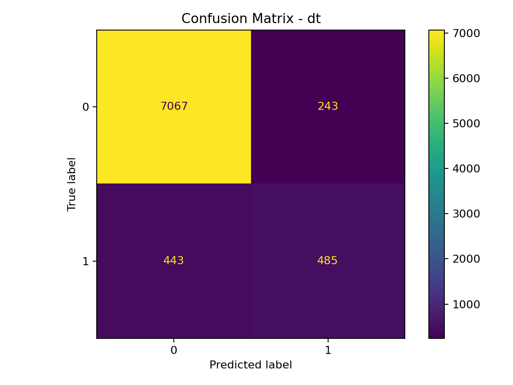
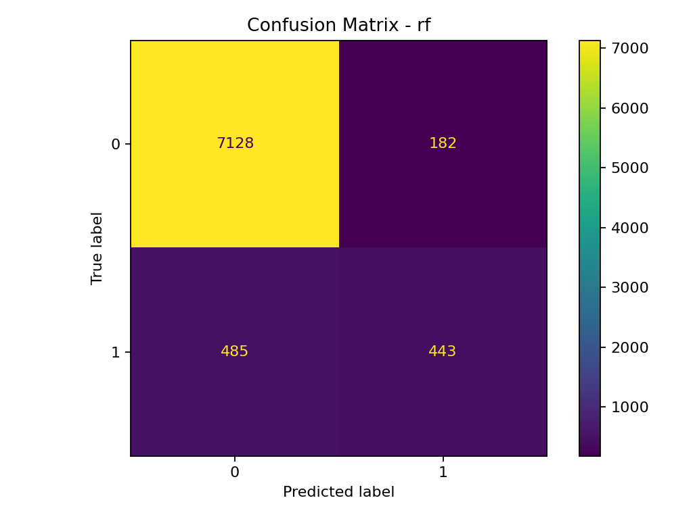

# Classification & Prediction Benchmark (Scikit-learn)

**Tech:** Python, Pandas, Scikit-learn, Matplotlib  
**Goal:** Compare multiple classification algorithms on a real dataset with full preprocessing and evaluation.

## Models compared
- Logistic Regression
- KNN
- SVM (RBF)
- Decision Tree
- Random Forest

## Evaluation
- 5-fold cross validation
- Confusion matrix
- Precision / Recall / F1-score

## Run
```bash
py -m venv .venv
.\.venv\Scripts\activate
pip install -r requirements.txt
py -m src.run_all

## Results summary (5-fold CV)
Best model: **Decision Tree** (F1 ≈ **0.562**)

## Example output


